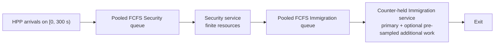

# Task 2 — System Design

**Status:** pooled-FCFS operational v1 executed in AnyLogic; the 15 × 10 pilot,
the 600-run capacity-expansion study, the 600-run capacity-availability study,
and the 2,700-run Base-demand response surface passed their declared gates

**Version:** 0.7, 2026-07-29

**Claim ceiling:** executable, traceable assumption sandbox; not a calibrated
HTX baseline, site forecast, digital twin, staffing recommendation, or
economic optimum

## Assessment map

| Requirement | Section | Evidence |
|---|---|---|
| a) Process Flow | A | AnyLogic process and entity event log |
| b) System Components | B | Generated model objects and resources |
| c) Input Parameters | C | Scenario and provenance registries |
| d) Simulation Outputs | D | Frozen schemas, estimates, contrasts, dashboard |
| e) Assumptions | E | Classified assumption register |

## Design rationale

The design follows one auditable chain:

> Human-adjudicated video aggregate → explicit homogeneous Poisson process
> (HPP) assumption → terminating two-stage DES → controlled scenario registry
> → independent replications → fail-closed validation → claim-bounded evidence.

- DES matches queues and finite resources whose state changes at discrete
  events. A pedestrian or agent-behaviour model would require spatial and
  interaction evidence that is unavailable. This applies the
  [minimum-sufficient conceptual-model principle](https://informs-sim.org/wsc17papers/includes/files/041.pdf).
- There is no signed event-time ledger, so v1 does not claim trace replay.
- Published service means do not identify a Lognormal, Gamma, or other
  distribution, so v1 uses fixed, named context values rather than inventing
  variance.
- A cutoff followed by full drain avoids silently censoring unfinished
  travellers. Independent replication-level estimands follow
  [terminating-simulation output analysis](https://informs-sim.org/wsc20papers/134.pdf);
  traveller rows are not treated as independent experiments.
- Verification establishes implementation integrity, not operational
  validity—an explicit distinction in
  [simulation V&V guidance](https://informs-sim.org/wsc20papers/002.pdf).

| Operational question | Controlled lever | Primary evidence |
|---|---|---|
| Where does the constraint move after adding capacity? | Security `+4`, Immigration `+3`, both | stage P95, utilization, total P95 |
| What happens when fewer service positions are available? | Security `-4`, Immigration `-3`, both, critical joint boundary | simultaneous peak and time-weighted queue length, cutoff backlog, recovery |
| How robust is the system to demand? | `0.8× / 1.2×` | total P95, cutoff WIP, clear time |
| How sensitive is it to Immigration service context? | fixed `10 / 13 / 24 / 45 s` | Immigration P95, total P95, clear time |
| What could effective automation change? | uptake × service multiplier | technology count, utilization, total P95 |
| Can rare long work be hidden by a wait KPI? | `2% × 900 / 7200 s` | clear time, cutoff WIP, system time |

## A. Process Flow



The model starts empty and idle. At 300 seconds it closes the source and
records completions, queues, in-service travellers, and total work in process
(WIP). It then runs without a fixed time stop until every admitted traveller
exits. A run fails if a traveller is rejected, dropped, left in the system, or
has an invalid event sequence.

### Implementation boundary

| Mechanism | Implementation status | Permitted interpretation |
|---|---|---|
| HPP at the accepted local-window rate | `IMPLEMENTED_ASSUMPTION` | stationary short-window sensitivity |
| Two pooled FCFS finite-resource stages | `IMPLEMENTED_EXECUTED` | operational v1 mechanism |
| Capacity, demand, and fixed service contexts | `IMPLEMENTED_EXECUTED` | conditional comparisons |
| Effective automation uptake × multiplier | `IMPLEMENTED_PROXY` | technology-service sensitivity |
| Counter-held additional work | `IMPLEMENTED_PROXY` | pessimistic risk boundary |
| Separate per-counter Immigration queues | `DESIGNED_DEFERRED` | no v1 queue-policy effect is claimed |
| Time-of-day demand and stochastic service | `BLOCKED_INPUT` | require timestamp and variability evidence |
| Separate secondary queue/resources | `BLOCKED_INPUT` | require routing, capacity, and service evidence |
| Calibrated walking and physical congestion | `OUT_OF_SCOPE_V1` | no spatial-performance claim |

A genuine separate-queue comparison requires replicated queues, an explicit
lane-assignment and tie rule, no-jockeying semantics, and counter-specific
logging. V1 rejects a configuration that merely relabels the pooled mechanism
as `separate`.

## B. System Components

| Component | Role |
|---|---|
| `OperationalTraveller` | Stores identifiers; arrival timestamp; fixed demands; automation, referral, and reserved tie-break draws; branch flags; timestamps; and resource IDs |
| `travellerSource` | Generates the finite HPP arrival cohort |
| `securityService` | Pooled FCFS queue and homogeneous Security resource pool |
| `immigrationService` | Pooled FCFS queue and homogeneous Immigration resource pool |
| Additional-work logic | Retains the Immigration counter for declared extra work; separately logged but not a separate resource |
| `arrivalCutoff` / `checkpointSink` | Snapshot cutoff state, record exits, and trigger termination after full drain |
| `OperationalInteractive` | Exploratory/ad-hoc Simulation experiment with a four-zone 2D Arrival → Security → Immigration → Exit view, live state metrics, and five genuine pre-run inputs |
| `OperationalPilot` | Registry-driven Parameter Variation batch |
| `CapacityRobustnessConfirmatory` | Frozen 12-cell capacity/rate Parameter Variation study with 50 replications per cell, serial evaluation, and one-shot GUI auto-start |
| `CapacityAvailabilityStress` | Independent Part 2 reduction study: 12 new execution cells × 50 replications, with the immutable 150-run Reference reused only after lineage and CRN gates |
| Validation/analysis pipeline | Consolidates output, validates contracts, estimates uncertainty, and builds the offline dashboard |

Technology is an effective mixture:

```text
technology_flag = automation_u < automation_uptake
primary_demand  = conventional_demand × automation_multiplier, if selected
```

`automation_uptake` combines eligibility, adoption, successful routing, and
use; it is not a calibrated adoption rate. If additional work is selected,
the same Immigration counter is held for `primary_demand + additional_demand`.
The referral flag is pre-sampled at admission and the total delay is scheduled
when Immigration begins. `immigration_primary_end` is therefore a derived
boundary timestamp, not a separate engine transition. This deliberately
conservative proxy does not assert ICA operating practice.

## C. Input Parameters

The executable sources of truth are the
[scenario registry](../config/operational_scenarios.csv),
[provenance registry](../config/provenance_registry.csv),
[scenario-to-evidence mapping](../config/scenario_provenance.csv), and
[result schema registry](../config/result_schema_registry.csv). Validation
rejects incomplete provenance, hidden defaults, illegal family changes, and
non-canonical configuration hashes.

### Reference assumption sandbox

| Input | Reference value | Evidence/use class |
|---|---:|---|
| Directional corridor line-crossing aggregate | 34 travellers / 24.922788889 s = `1.364213/s` | accepted short-window cross-section measurement; not a measured processing-unit arrival stream |
| Arrival process | HPP for `300 s`, then full drain | transparent assumption |
| Security service | fixed `21.818181818 s` | reciprocal of external 165 passengers/hour/lane bound |
| Immigration service | fixed `13 s` | named Singapore land bus-hall passport context |
| Security / Immigration capacity | `36 / 21` | `ceil(lambda × service / 0.85)` reference rule |
| Queue guards | `5000 / 5000` | non-binding finite implementation guard |
| Queue / initial state | pooled FCFS; empty and idle | implemented structural assumption |
| Automation / additional work | disabled | isolated in sensitivity rows |
| Replications | `10` per scenario | variance and pipeline pilot, not confirmatory precision |

The accepted `1.364213/s` is an aggregate directional crossing rate at one
corridor cross-section. The executable sandbox conditionally routes the full
rate into one pooled Security → Immigration abstraction. It does not observe
how corridor traffic is allocated among physical processing zones, halls,
lanes, or eligibility streams. That mapping—and any sharing or overflow
rule—requires site data and is not inferred from the clip.

### Load-regime design and utilization semantics

The reference capacities were selected before outcome inspection using
`ceil(lambda × mean_service / 0.85)`. They were not retuned after the
confirmatory results. At the three frozen arrival-rate levels, the resulting
nominal offered loads are:

| Arrival level | Rate (/s) | Reference Security / Immigration | Joint +4/+3 Security / Immigration |
|---|---:|---:|---:|
| Exact-count low | `0.944757` | `0.573 / 0.585` | `0.515 / 0.512` |
| Point estimate / base | `1.364213` | `0.827 / 0.845` | `0.744 / 0.739` |
| Exact-count high | `1.906351` | `1.155 / 1.180` | `1.040 / 1.033` |

This grid deliberately crosses from light load through a decision-relevant
stressed regime. Three quantities must not be conflated:

1. **Nominal offered load** is `lambda × mean_service / capacity`.
2. **Arrival-window utilization** is busy resource-time divided by available
   resource-time during the fixed 300-second arrival window.
3. **Full-drain utilization** uses the longer, scenario-specific drain
   horizon and can fall when a long tail extends that denominator.

The original run KPI exports the third quantity. A post-hoc supporting
analysis derives the first two from the immutable entity ledger without
rerunning or changing the frozen 600-run study. For example, high-rate
arrival-window utilization is `0.964 / 0.902` for reference and
`0.948 / 0.881` for joint +4/+3. These are model diagnostics, not measured
checkpoint utilization.

`OperationalInteractive` exposes exactly five editable pre-run parameters:
`demand_multiplier`, `security_capacity`, `immigration_capacity`,
`automation_uptake`, and `automation_multiplier`. The queue policy is not an
interactive control: pooled FCFS is the only implemented v1 mechanism, so a
queue-policy selector would misrepresent the model.

### Scenario matrix

Only declared fields may change within a family.

| Family | Rows | Change from reference | Evidence role |
|---|---:|---|---|
| Reference | 1 | none | named comparison anchor, not measured baseline |
| Capacity | 3 | Security `+4`, Immigration `+3`, or both | operational lever |
| Demand | 2 | `0.8× / 1.2×` | illustrative stress |
| Service context | 3 | Immigration `10 / 24 / 45 s`; reference `13 s` | separate official Singapore contexts |
| Automation | 4 | uptake `0.5 / 1.0`; multiplier `0.6 / 0.4` | illustrative mapping of official-context effects |
| Risk boundary | 2 | `2%` selected for `900 / 7200 s` counter-held work | external low/high boundary |

Every input is classified as local measurement, official Singapore context,
external benchmark, structural literature, transparent assumption, or
illustrative scenario. A result cannot make a stronger claim than its weakest
decision-relevant input.

The frozen capacity confirmation crosses the reference, Security `+4`,
Immigration `+3`, and joint `+4/+3` alternatives with the exact-count HPP
low, point-estimate, and high arrival-rate levels: `4 × 3 = 12` cells. Each
cell has 50 fixed replications, giving 600 serial runs. Service times, pooled
FCFS, empty/idle start, the 300-second arrival window, and full drain remain
fixed registered assumptions.

For scenario index `i` and replication `r`, the stream base is
`master_seed + 100000i + 100r`; arrival, service, routing, and tie seeds use
offsets `+1` to `+4`. Arrival consumes its stream, while fixed v1 service does
not consume `service_seed`. The reserved tie draw has no routing effect in the
pooled model. Recording a seed or draw is not evidence that stochastic service,
CRN alignment, or separate lanes are implemented. The pilot's CRN status
therefore remains `NOT_TESTED`. The confirmatory study uses a separate frozen
seed manifest and permits paired inference only because its traveller-level
alignment gate returned `PASS`.

Part 2 keeps that 600-run expansion study immutable and tests the complementary
availability question. It executes Security `32/21`, Immigration `36/18`,
joint `32/18`, and critical-boundary `30/17` configurations across the same
three arrival-rate levels, with 50 replications per cell: 600 new runs.
Analysis adds the 150 read-only `36/21` Reference runs for 750 runs in total.
The primary metric is the base-rate `32/18 minus 36/21` difference in
replication-level simultaneous peak total waiting queue. The design and claim
boundary are frozen in
[`task3_capacity_availability_design.md`](task3_capacity_availability_design.md).
Execution is complete: all 600 new runs and the 750-run merged analysis passed
coverage, lineage, conservation, full-drain, and traveller-level CRN gates.
The registered primary contrast is `+10.10` travellers (paired 95% CI
`[8.23, 11.97]`). Supporting results identify Immigration availability as the
stronger base-rate near-saturation constraint under the registered assumptions
and show sharply nonlinear queue growth at the high arrival boundary.

## D. Simulation Outputs

The model writes one manifest and KPI row per replication and one
traveller-level row containing multiple event timestamps per traveller.
Analysis then produces scenario estimates and
scenario-minus-reference contrasts.

| Output group | Exported v1 measures |
|---|---|
| Flow integrity | arrivals, completions at cutoff, total completions at full drain, `rejected_or_dropped_count`, `conservation_pass`, and `run_status` |
| Cutoff state | stage queues, stage in-service counts, total WIP, fraction not exited |
| Waiting and time | stage/total mean and within-replication P95, registered 600/900/1200-second exceedance, system time; post-hoc 15/30/60-second model-scale diagnostics are kept separate |
| Resources and branches | full-drain utilization, technology count, additional-check count |
| Recovery | drain-end time and cohort clear time after cutoff |

For traveller `i`,
`total_queue_wait_i = security_wait_i + immigration_wait_i`, and
`system_time_i = exit_i - arrival_i`. At cutoff:

```text
arrivals - completed
  = security queue + security in service
  + immigration queue + immigration in service
  = cutoff WIP
```

The schema retains `cutoff_backlog` for compatibility, but it means “not yet
exited at cutoff”; it is not automatically congestion. Utilization is
normalized through the full-drain horizon, not the 300-second arrival window.

The primary estimand is the mean across replications of each replication's
`total_queue_wait_p95_seconds`. Scenario estimates use 95% Student-t
intervals. Within a replication, P95 is the nearest-rank observation at
`ceil(0.95n) - 1` in zero-based indexing; exceedance rates use strict `>` at
600, 900, and 1200 seconds. Those registered thresholds remain useful for
extreme risk-bound rows but do not discriminate the capacity study. The
supplement therefore reports strict `>` 15/30/60-second total-wait rates as
post-hoc supporting diagnostics only—not ICA service standards or
prospectively registered decision rules. Pilot common-random-number alignment is
`NOT_TESTED`, so pilot contrasts use independent Welch intervals. The frozen
confirmatory capacity study passed its seed, traveller-set, and
branch-invariant-draw alignment gate and therefore uses the pre-specified
paired Student-t method within an arrival-rate level.
Maximum/time-weighted queue length, lane KPIs, and technology subgroup gaps
are not exported in v1. Arrival-window utilization is not an original run KPI;
it is reconstructed in the post-hoc supplement from the immutable stage
timestamps and is hash-linked to the same 253,756-row entity ledger.

## E. Assumptions

| Category | Assumption or exclusion | Status / consequence |
|---|---|---|
| Data | Right-to-left is the arrival direction; 34 crossings are accepted | aggregate only; no signed event-time ledger |
| Demand | Stationary independent arrivals over 300 seconds | no time-of-day or burst calibration |
| Process | Security precedes Immigration; additional work follows primary Immigration | local two-stage boundary |
| Queue | Both stages are pooled FCFS | no priority, balking, reneging, jockeying, or abandonment |
| Service | Published means/bounds become fixed service values | variability is not inferred |
| Resources | Servers are homogeneous and continuously available within a run | no skill mix, breaks, downtime, or roster feasibility |
| Capacity | Reference capacities target roughly 85% offered-load utilization | derived assumption, not observed staffing |
| Structural scale | Full accepted corridor rate is conditionally mapped to one pooled two-stage abstraction | processing-unit allocation, physical-zone topology, and routing/overflow are unobserved |
| Technology | Effective uptake combines eligibility, adoption, routing, and success | no component-level causal attribution |
| Exceptions | Additional work holds the Immigration counter | conservative proxy; no secondary-pool claim |
| Experiment | Empty/idle start, 300-second arrival window, full drain | terminating cohort, not steady state |
| Statistics | Ten independent pilot replications; 50 per confirmatory cell with verified within-rate CRN | pilot rankings remain provisional; confirmatory claims remain limited to the frozen question |
| Scope | Walking, spatial congestion, costs, nationality/eligibility routing, and rosters excluded | no layout, equity, staffing, or economic recommendation |
| Validity | Local service, roster, queue, referral, and outcome data are unavailable | no calibrated baseline or site forecast |

The accepted `N = 34` arrival aggregate cannot be reconstructed as a signed
event-time ledger without target-fitting across incompatible candidate
outputs. Accordingly, the HPP layer is conditional on the accepted aggregate;
within-window stationarity and empirical inter-arrival structure remain
untested. The generic `parameter_registry.csv` records the measurement layer;
the executable capacity and service truth is
`config/operational_scenarios.csv`.

APICS/APCS group processing would require a batch-service mechanism.
Identification-on-the-move would require sensing, walking-throughput, failure,
and recapture evidence. Neither is represented by setting service time to
zero.

## Verification and Handoff

| Gate | Recorded status |
|---|---:|
| Scenario/provenance contract | `PASS`, 15 scenarios |
| Exact pilot coverage | `PASS`, 150 / 150 |
| Schema, lineage, event order, and cutoff conservation | `PASS` |
| Resource-capacity constraint | `ENFORCED_BY_ANYLOGIC`; independent interval-overlap audit `NOT PERFORMED` |
| Full drain / rejected or dropped travellers | `150 / 150 PASS` / `0` |
| Traveller rows / scenario estimates / exploratory contrasts | `61,218 / 165 / 154` |
| Confirmatory coverage / entity rows | `600 / 600 PASS` / `253,756` |
| Confirmatory CRN alignment | `PASS`, 150 within-rate replication groups |
| Deterministic two-stage oracle | `PASS`, exact six-traveller trace |
| Pilot CRN / separate queues / field calibration | `NOT_TESTED / NOT IMPLEMENTED / NOT PERFORMED` |

`OperationalInteractive` provides a four-zone 2D process view from Arrival to
Security to Immigration to Exit. During a run it shows admitted/completed
counts, Security and Immigration queue and in-service counts, queue maxima,
technology/additional-check counts, and `run_status`. Its five inputs must be
set before Run; AnyLogic's built-in Pause/Resume/Stop controls govern
execution. The run is labelled exploratory/ad-hoc, uses replication `0`, and
writes outside the reportable replicated collections. It is suitable for
mechanism exploration and demonstration, not reportable inference. Reportable
claims come from validated replication outputs from `OperationalPilot` or the
frozen `CapacityRobustnessConfirmatory` study.

`CapacityRobustnessConfirmatory` is a visible Parameter Variation experiment.
A private one-shot timer starts it automatically; evaluation is serial and
fixed at `12 × 50 = 600` runs. The tracked compact package under
`results/analysis/confirmatory_capacity/` records `600/600 PASS`, 253,756
entities, CRN alignment `PASS`, and the conditional paired analysis. These
software and analysis gates do not calibrate the model or turn its capacity
comparison into a staffing recommendation.

Evidence:

- [Task 3 operational contract](task3_operational_contract.md)
- [Task 3 results](task3_results.md)
- [AnyLogic build and run guide](../simulation/anylogic/OPERATIONAL_BUILD_GUIDE.md)
- [Strict validation report](../results/analysis/operational/validation.json)
- [Operational dashboard](../results/analysis/operational/operational_dashboard.png)
- [Confirmatory compact audit manifest](../results/analysis/confirmatory_capacity/audit_manifest.json)
- [Confirmatory strict validation](../results/analysis/confirmatory_capacity/validation.json)
- [Confirmatory CRN alignment](../results/analysis/confirmatory_capacity/crn_alignment.json)
- [Confirmatory primary result](../results/analysis/confirmatory_capacity/primary_result.json)
