# Task 2 — System Design

**Status:** working conceptual model, engine mapping pending smoke gate
**Version:** 0.1, 2026-07-26

## 1. Purpose and decision boundary

The model is a traveller-level, terminating discrete-event simulation of a
local checkpoint entrance process:

```text
Arrival → Security queue/service → Immigration queue/service
        → optional additional Immigration check → Exit
```

It supports controlled comparisons of:

- Security capacity;
- Immigration capacity;
- separate versus pooled Immigration queues;
- technology-enabled Immigration service as an effective-uptake mixture; and
- local-demand and input-measurement sensitivity.

The model does not represent an entire real checkpoint, predict physical crowd
motion, optimise security policy, or claim operational validation. The supplied
video is used for local arrival evidence under the two premises stated in the
assessment; service times, resources, routing, and exception probabilities are
transparent assumptions until corresponding local data are supplied.

## 2. Why discrete-event simulation

The decision variables act on finite resources and queues, while the relevant
state changes occur at distinct events: arrival, queue entry, service start,
service completion, additional-check completion, and exit. DES therefore
matches the question directly. A frame-based animation would make outputs
depend on rendering speed; a calibrated pedestrian/agent-behaviour model would
require spatial, route-choice, and interaction evidence that is not available.

AnyLogic PLE is the primary implementation because it combines an inspectable
Process Modeling Library flow, primitive 2D animation, configurable
experiments, and result displays. The conceptual model and data contract remain
engine-independent so that a verified SimPy implementation can replace it if
the PLE batch/export/seed gate fails.

## 3. Conceptual flow

```mermaid
flowchart LR
    A["Arrival process<br/>trace or sampled input"] --> SQ["Security FCFS queue"]
    SQ --> SS["Seize Security unit"]
    SS --> SD["Security service delay"]
    SD --> SR["Release Security unit"]
    SR --> IP{"Immigration queue policy"}
    IP -->|pooled| PQ["One FCFS queue"]
    IP -->|separate| LQ["Shortest of C lane queues<br/>pre-generated tie break"]
    PQ --> IS["Seize Immigration counter"]
    LQ --> IS
    IS --> MODE{"Technology-enabled?"}
    MODE -->|no| CONV["Conventional primary service"]
    MODE -->|yes| AUTO["m_auto × primary service demand"]
    CONV --> EX{"Additional check?"}
    AUTO --> EX
    EX -->|yes| ADD["Additional-check delay<br/>counter remains seized"]
    EX -->|no| IR["Release Immigration counter"]
    ADD --> IR
    IR --> OUT["Exit and entity log"]
```



The additional check is a visible, conditional workload component. In the core
model the traveller keeps the same Immigration counter through the additional
delay. This avoids inventing an unobserved secondary resource pool while still
exposing the mechanism. A future model may add a separate referral queue and
resource only when its capacity, routing, and service data are available.

## 4. Entities, attributes, resources, and events

### Traveller

Every traveller has immutable exogenous draws or identifiers created before a
policy branch can change random-number consumption:

| Attribute | Meaning |
|---|---|
| `traveller_id` | Stable identifier within an input sample |
| `arrival_time` | Local arrival time |
| `security_service_demand` | Positive Security work requirement |
| `immigration_service_demand` | Positive conventional Immigration work requirement |
| `technology_u` | Uniform draw used with `effective_uptake` |
| `additional_check_u` | Uniform draw used with the applicable check probability |
| `additional_check_demand` | Positive extra-work requirement if selected |
| `lane_tie_u` | Pre-generated tie breaker for equal shortest queues |
| `input_sample_id` | Arrival/input-uncertainty sample |
| `replication_id` | Stochastic replication |

Mutable attributes record queue/lane assignment, technology and check flags,
resource IDs, and every event timestamp.

### Resources

- `security_resources`: homogeneous finite units, capacity `C_security`;
- `immigration_resources`: homogeneous finite units, capacity `C_immigration`;
- no independent additional-check resource in model version 0.1.

Resource capacity may be changed between runs, not silently during a run.

### Event sequence

For every traveller, the legal order is:

```text
arrival
≤ security_queue_join
≤ security_start
≤ security_end
≤ immigration_queue_join
≤ immigration_start
≤ immigration_primary_end
≤ optional_additional_check_end
≤ exit
```

No event may begin before its predecessor, and no resource occupancy may exceed
configured capacity.

## 5. Queue-policy mechanism

Security uses one FCFS queue feeding the same `C_security` homogeneous units in
all scenarios.

Immigration changes only its queue discipline:

- **Pooled:** one FCFS queue feeds `C_immigration` identical counters.
- **Separate:** `C_immigration` FCFS queues each feed one counter. A traveller
  chooses a currently shortest queue on arrival, does not jockey, and uses its
  pre-generated `lane_tie_u` to break equal-length ties.

The policy comparison holds constant:

- counter count and availability;
- traveller arrival ledger;
- conventional service demands;
- technology/check flags and demands;
- initial state and arrival/drain horizon; and
- all KPI definitions.

In AnyLogic, the separate path is implemented with replicated lane blocks,
each containing its own queue and single-capacity service, addressed through an
Enter/Exit or SelectOutputIn/Out connection. The pooled path uses one queue and
a resource pool of the same size. Replicated block count is set at model
initialisation; an interactive capacity change therefore takes effect through
Apply → Reset → Run.

## 6. Technology and additional-check semantics

`effective_uptake` is the proportion that actually receives the faster
technology-enabled service. It intentionally combines eligibility, adoption,
and successful routing because none of those components is measured locally.
It must not be described as a calibrated adoption rate.

For each traveller:

```text
technology_enabled = technology_u < effective_uptake

primary_immigration_demand =
    immigration_service_demand × automation_multiplier
        if technology_enabled
    immigration_service_demand
        otherwise
```

The published `0.6` and `0.4` multipliers are separate contextual scenario
anchors from different rollout reports, not local service-time measurements.
They are never averaged.

After primary service, `additional_check_u` is compared with a declared
mode-specific or common probability. Additional-check demand is not multiplied
by the technology factor. This prevents faster primary service and exception
handling from being counted as the same effect.

If automated and conventional travellers later use separate resource pools,
that is a new model version requiring explicit eligibility, conditional
adoption, success/failure, capacity, and routing inputs.

## 7. Configurable inputs

The authoritative keys, units, provenance, ranges, and status live in
`config/parameter_registry.csv`; scenario changes live in
`config/scenarios.csv`.

| Group | Inputs |
|---|---|
| Arrival | final audited event ledger or stochastic input family, rate/sample ID, demand multiplier, direction mapping |
| Resources | `C_security`, `C_immigration`, initial availability |
| Queue policy | `separate` or `pooled`, separate-lane tie rule |
| Service | positive distribution family and parameters for Security, conventional Immigration, and additional check |
| Technology | `effective_uptake`, `automation_multiplier` |
| Exceptions | conventional/technology-enabled additional-check probabilities |
| Experiment | arrival horizon, initial state/pre-period, drain rule, scenario ID, input sample ID, replication ID, stream/seed manifest |
| Presentation | animation speed only; it must not alter simulation time or results |

Unfrozen parameters fail validation rather than silently using a hidden default.

## 8. Terminating-run protocol

1. Initialise the declared empty state or preloaded state.
2. Admit the pre-specified arrival cohort during the arrival window.
3. At cutoff, stop new arrivals and snapshot completions, queues, in-service
   travellers, and resource state.
4. Continue until the entire admitted cohort exits.
5. Derive all KPIs from the same immutable entity/event log.

The arrival window is selected after the final upper input rate confirms that
the PLE dynamic-agent limit has sufficient headroom. Draining prevents
completion-only bias; cutoff metrics preserve the operational consequences of
unfinished work.

## 9. Outputs and KPI definitions

### Required data products

**Run manifest — one row per replication**

`schema_version, config_hash, code/model_version, scenario_id,
input_sample_id, replication_id, stream_seed_ids, start_state, arrival_cutoff,
drain_end, engine_version`

**Entity event log — one row per traveller**

`traveller_id, scenario_id, input_sample_id, replication_id, arrival,
security_queue_join, security_start, security_end, immigration_queue_join,
immigration_lane, immigration_start, immigration_primary_end,
additional_check_flag, additional_check_end, technology_flag, exit,
security_resource_id, immigration_resource_id`

**Replication KPI table — one row per replication**

- arrivals and completions at cutoff and after drain;
- mean and P95 Security, Immigration, and total queue wait;
- share above the illustrative wait threshold;
- cutoff queue/WIP/backlog and cohort clear time;
- maximum and time-weighted queue length by stage/lane;
- Security and Immigration utilisation;
- additional-check count/load; and
- technology/conventional subgroup service-level gap.

`Q95_r` is calculated within each replication's fixed arrival cohort. Formal
analysis treats the replication-level values—not pooled traveller rows—as the
statistical sample.

## 10. Interactive display

The executable model provides:

- a primitive 2D `Arrival → Security → Immigration → Exit` layout;
- visible travellers, both queues, occupied/free resources, and additional
  checks;
- controls for scenario, demand, capacities, queue policy, effective uptake,
  automation multiplier, and exception probability;
- Apply, Reset, Run/Pause, and animation-speed controls; and
- a compact live/post-run dashboard for counts, queues, utilisation, total
  waiting P95, cutoff backlog, and clear time.

Controls validate values and require a reset before structural changes. A
single animated run is labelled illustrative; policy evidence comes from the
replicated experiment output.

## 11. Verification and validity gates

Before formal results:

1. **Deterministic trace:** a hand-worked tiny arrival/service schedule matches
   event times and queue order exactly.
2. **Conservation:** after drain, arrivals equal exits; at cutoff, arrivals
   equal exits plus all queued/in-service travellers.
3. **Capacity:** occupancy never exceeds configured units.
4. **Sequence:** all entity timestamps satisfy the legal event order.
5. **Extremes:** zero arrivals; capacity one; high demand; technology uptake
   zero/one; additional-check probability zero/one.
6. **Queue mechanism:** pooled has one FCFS queue; separate has one per counter;
   a config diff confirms no other factor changed.
7. **Reproducibility:** the same manifest is byte-identical; a changed
   replication seed changes stochastic draws.
8. **CRN alignment:** traveller IDs and exogenous draws match across policy
   scenarios before paired analysis is allowed.
9. **Analytical check:** a simple single-stage special case is compared with an
   appropriate queueing calculation or deterministic result.
10. **Operational-validity boundary:** without local service-time, roster,
    queue, exception, and output data, results remain bounded what-if evidence,
    not a validated site forecast.

## 12. Primary assumptions and exclusions

- The observed crowd and built-up area are accepted only as the assessment's
  baseline-population and entrance-area premises.
- The final arrival rate and operational direction remain unfrozen until the
  crossing ledger, false-negative sweep, and owner sign-off are complete.
- Resources are homogeneous in the primary queue-policy comparison.
- No abandonment, balking, jockeying, priority class, shift break, downtime, or
  group service is included in version 0.1.
- Walking time and spatial congestion are not calibrated; 2D movement is
  explanatory.
- APICS/APCS group or in-vehicle processing would require a batch/group-service
  mechanism. Identification-on-the-move would require coupled sensing,
  walking-throughput, failure, and recapture evidence. Neither is simulated by
  merely setting service time to zero.

These exclusions are extensions only when they can change the decision and
have a defensible mechanism and evidence base.
