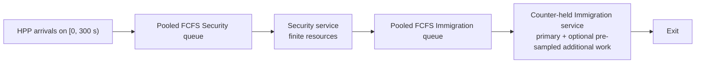

# Task 2 — System Design

**Status:** pooled-FCFS operational v1 executed in AnyLogic; 15 scenarios × 10
replications passed the strict output contract

**Version:** 0.4, 2026-07-28

**Claim ceiling:** executable, traceable assumption sandbox; not a calibrated
HTX baseline, site forecast, digital twin, staffing recommendation, or
economic optimum

## Assessment map

| Requirement | Section | Evidence |
|---|---|---|
| a) Process Flow | A | AnyLogic process and entity event log |
| b) System Components | B | Generated model objects and resources |
| c) Input Parameters | C | Scenario and provenance registries |
| d) Simulation Outputs | D | Frozen schemas, estimates, contrasts, dashboard |
| e) Assumptions | E | Classified assumption register |

## Design rationale

The design follows one auditable chain:

> Human-adjudicated video aggregate → explicit homogeneous Poisson process
> (HPP) assumption → terminating two-stage DES → controlled scenario registry
> → independent replications → fail-closed validation → claim-bounded evidence.

- DES matches queues and finite resources whose state changes at discrete
  events. A pedestrian or agent-behaviour model would require spatial and
  interaction evidence that is unavailable. This applies the
  [minimum-sufficient conceptual-model principle](https://informs-sim.org/wsc17papers/includes/files/041.pdf).
- There is no signed event-time ledger, so v1 does not claim trace replay.
- Published service means do not identify a Lognormal, Gamma, or other
  distribution, so v1 uses fixed, named context values rather than inventing
  variance.
- A cutoff followed by full drain avoids silently censoring unfinished
  travellers. Independent replication-level estimands follow
  [terminating-simulation output analysis](https://informs-sim.org/wsc20papers/134.pdf);
  traveller rows are not treated as independent experiments.
- Verification establishes implementation integrity, not operational
  validity—an explicit distinction in
  [simulation V&V guidance](https://informs-sim.org/wsc20papers/002.pdf).

| Operational question | Controlled lever | Primary evidence |
|---|---|---|
| Where does the constraint move after adding capacity? | Security `+4`, Immigration `+3`, both | stage P95, utilization, total P95 |
| How robust is the system to demand? | `0.8× / 1.2×` | total P95, cutoff WIP, clear time |
| How sensitive is it to Immigration service context? | fixed `10 / 13 / 24 / 45 s` | Immigration P95, total P95, clear time |
| What could effective automation change? | uptake × service multiplier | technology count, utilization, total P95 |
| Can rare long work be hidden by a wait KPI? | `2% × 900 / 7200 s` | clear time, cutoff WIP, system time |

## A. Process Flow



The model starts empty and idle. At 300 seconds it closes the source and
records completions, queues, in-service travellers, and total work in process
(WIP). It then runs without a fixed time stop until every admitted traveller
exits. A run fails if a traveller is rejected, dropped, left in the system, or
has an invalid event sequence.

### Implementation boundary

| Mechanism | Implementation status | Permitted interpretation |
|---|---|---|
| HPP at the accepted local-window rate | `IMPLEMENTED_ASSUMPTION` | stationary short-window sensitivity |
| Two pooled FCFS finite-resource stages | `IMPLEMENTED_EXECUTED` | operational v1 mechanism |
| Capacity, demand, and fixed service contexts | `IMPLEMENTED_EXECUTED` | conditional comparisons |
| Effective automation uptake × multiplier | `IMPLEMENTED_PROXY` | technology-service sensitivity |
| Counter-held additional work | `IMPLEMENTED_PROXY` | pessimistic risk boundary |
| Separate per-counter Immigration queues | `DESIGNED_DEFERRED` | no v1 queue-policy effect is claimed |
| Time-of-day demand and stochastic service | `BLOCKED_INPUT` | require timestamp and variability evidence |
| Separate secondary queue/resources | `BLOCKED_INPUT` | require routing, capacity, and service evidence |
| Calibrated walking and physical congestion | `OUT_OF_SCOPE_V1` | no spatial-performance claim |

A genuine separate-queue comparison requires replicated queues, an explicit
lane-assignment and tie rule, no-jockeying semantics, and counter-specific
logging. V1 rejects a configuration that merely relabels the pooled mechanism
as `separate`.

## B. System Components

| Component | Role |
|---|---|
| `OperationalTraveller` | Stores identifiers; arrival timestamp; fixed demands; automation, referral, and reserved tie-break draws; branch flags; timestamps; and resource IDs |
| `travellerSource` | Generates the finite HPP arrival cohort |
| `securityService` | Pooled FCFS queue and homogeneous Security resource pool |
| `immigrationService` | Pooled FCFS queue and homogeneous Immigration resource pool |
| Additional-work logic | Retains the Immigration counter for declared extra work; separately logged but not a separate resource |
| `arrivalCutoff` / `checkpointSink` | Snapshot cutoff state, record exits, and trigger termination after full drain |
| `OperationalInteractive` | One locked canonical reference smoke run, not a custom scenario-control panel |
| `OperationalPilot` | Registry-driven Parameter Variation batch |
| Validation/analysis pipeline | Consolidates output, validates contracts, estimates uncertainty, and builds the offline dashboard |

Technology is an effective mixture:

```text
technology_flag = automation_u < automation_uptake
primary_demand  = conventional_demand × automation_multiplier, if selected
```

`automation_uptake` combines eligibility, adoption, successful routing, and
use; it is not a calibrated adoption rate. If additional work is selected,
the same Immigration counter is held for `primary_demand + additional_demand`.
The referral flag is pre-sampled at admission and the total delay is scheduled
when Immigration begins. `immigration_primary_end` is therefore a derived
boundary timestamp, not a separate engine transition. This deliberately
conservative proxy does not assert ICA operating practice.

## C. Input Parameters

The executable sources of truth are the
[scenario registry](../config/operational_scenarios.csv),
[provenance registry](../config/provenance_registry.csv),
[scenario-to-evidence mapping](../config/scenario_provenance.csv), and
[result schema registry](../config/result_schema_registry.csv). Validation
rejects incomplete provenance, hidden defaults, illegal family changes, and
non-canonical configuration hashes.

### Reference assumption sandbox

| Input | Reference value | Evidence/use class |
|---|---:|---|
| Arrival aggregate | 34 travellers / 24.922788889 s = `1.364213/s` | accepted local short-window measurement |
| Arrival process | HPP for `300 s`, then full drain | transparent assumption |
| Security service | fixed `21.818181818 s` | reciprocal of external 165 passengers/hour/lane bound |
| Immigration service | fixed `13 s` | named Singapore land bus-hall passport context |
| Security / Immigration capacity | `36 / 21` | `ceil(lambda × service / 0.85)` reference rule |
| Queue guards | `5000 / 5000` | non-binding finite implementation guard |
| Queue / initial state | pooled FCFS; empty and idle | implemented structural assumption |
| Automation / additional work | disabled | isolated in sensitivity rows |
| Replications | `10` per scenario | variance and pipeline pilot, not confirmatory precision |

### Scenario matrix

Only declared fields may change within a family.

| Family | Rows | Change from reference | Evidence role |
|---|---:|---|---|
| Reference | 1 | none | named comparison anchor, not measured baseline |
| Capacity | 3 | Security `+4`, Immigration `+3`, or both | operational lever |
| Demand | 2 | `0.8× / 1.2×` | illustrative stress |
| Service context | 3 | Immigration `10 / 24 / 45 s`; reference `13 s` | separate official Singapore contexts |
| Automation | 4 | uptake `0.5 / 1.0`; multiplier `0.6 / 0.4` | illustrative mapping of official-context effects |
| Risk boundary | 2 | `2%` selected for `900 / 7200 s` counter-held work | external low/high boundary |

Every input is classified as local measurement, official Singapore context,
external benchmark, structural literature, transparent assumption, or
illustrative scenario. A result cannot make a stronger claim than its weakest
decision-relevant input.

For scenario index `i` and replication `r`, the stream base is
`master_seed + 100000i + 100r`; arrival, service, routing, and tie seeds use
offsets `+1` to `+4`. Arrival consumes its stream, while fixed v1 service does
not consume `service_seed`. The reserved tie draw has no routing effect in the
pooled model. Recording a seed or draw is not evidence that stochastic service,
CRN alignment, or separate lanes are implemented.

## D. Simulation Outputs

The model writes one manifest and KPI row per replication and one
traveller-level row containing multiple event timestamps per traveller.
Analysis then produces scenario estimates and
scenario-minus-reference contrasts.

| Output group | Exported v1 measures |
|---|---|
| Flow integrity | arrivals, completions at cutoff, total completions at full drain, `rejected_or_dropped_count`, `conservation_pass`, and `run_status` |
| Cutoff state | stage queues, stage in-service counts, total WIP, fraction not exited |
| Waiting and time | stage/total mean and within-replication P95, 600/900/1200-second exceedance, system time |
| Resources and branches | full-drain utilization, technology count, additional-check count |
| Recovery | drain-end time and cohort clear time after cutoff |

For traveller `i`,
`total_queue_wait_i = security_wait_i + immigration_wait_i`, and
`system_time_i = exit_i - arrival_i`. At cutoff:

```text
arrivals - completed
  = security queue + security in service
  + immigration queue + immigration in service
  = cutoff WIP
```

The schema retains `cutoff_backlog` for compatibility, but it means “not yet
exited at cutoff”; it is not automatically congestion. Utilization is
normalized through the full-drain horizon, not the 300-second arrival window.

The primary estimand is the mean across replications of each replication's
`total_queue_wait_p95_seconds`. Scenario estimates use 95% Student-t
intervals. Within a replication, P95 is the nearest-rank observation at
`ceil(0.95n) - 1` in zero-based indexing; exceedance rates use strict `>` at
600, 900, and 1200 seconds. Common-random-number alignment is `NOT_TESTED`, so
v1 prohibits paired claims and uses independent Welch intervals.
Maximum/time-weighted queue length, lane KPIs, technology subgroup gaps, and
arrival-window utilization are not exported in v1.

## E. Assumptions

| Category | Assumption or exclusion | Status / consequence |
|---|---|---|
| Data | Right-to-left is the arrival direction; 34 crossings are accepted | aggregate only; no signed event-time ledger |
| Demand | Stationary independent arrivals over 300 seconds | no time-of-day or burst calibration |
| Process | Security precedes Immigration; additional work follows primary Immigration | local two-stage boundary |
| Queue | Both stages are pooled FCFS | no priority, balking, reneging, jockeying, or abandonment |
| Service | Published means/bounds become fixed service values | variability is not inferred |
| Resources | Servers are homogeneous and continuously available within a run | no skill mix, breaks, downtime, or roster feasibility |
| Capacity | Reference capacities target roughly 85% offered-load utilization | derived assumption, not observed staffing |
| Technology | Effective uptake combines eligibility, adoption, routing, and success | no component-level causal attribution |
| Exceptions | Additional work holds the Immigration counter | conservative proxy; no secondary-pool claim |
| Experiment | Empty/idle start, 300-second arrival window, full drain | terminating cohort, not steady state |
| Statistics | Ten independent pilot replications; CRN unverified | fine rankings remain provisional |
| Scope | Walking, spatial congestion, costs, nationality/eligibility routing, and rosters excluded | no layout, equity, staffing, or economic recommendation |
| Validity | Local service, roster, queue, referral, and outcome data are unavailable | no calibrated baseline or site forecast |

APICS/APCS group processing would require a batch-service mechanism.
Identification-on-the-move would require sensing, walking-throughput, failure,
and recapture evidence. Neither is represented by setting service time to
zero.

## Verification and Handoff

| Gate | Recorded status |
|---|---:|
| Scenario/provenance contract | `PASS`, 15 scenarios |
| Exact pilot coverage | `PASS`, 150 / 150 |
| Schema, lineage, event order, and cutoff conservation | `PASS` |
| Resource-capacity constraint | `ENFORCED_BY_ANYLOGIC`; independent interval-overlap audit `NOT PERFORMED` |
| Full drain / rejected or dropped travellers | `150 / 150 PASS` / `0` |
| Traveller rows / scenario estimates / exploratory contrasts | `61,218 / 165 / 154` |
| Deterministic two-stage oracle | `PASS`, exact six-traveller trace |
| CRN alignment / separate queues / field calibration | `NOT_TESTED / NOT_IMPLEMENTED / NOT PERFORMED` |

The current GUI is intentionally minimal. `OperationalInteractive` is
replication `0`, writes to a separate smoke-output collection, and is excluded
from reportable Pilot consolidation. `OperationalPilot` auto-starts the
registered batch, and the reviewer dashboard is generated offline. Rich custom
controls and a live dashboard are presentation extensions, not delivered
mechanisms.

Evidence:

- [Task 3 operational contract](task3_operational_contract.md)
- [Task 3 results](task3_results.md)
- [AnyLogic build and run guide](../simulation/anylogic/OPERATIONAL_BUILD_GUIDE.md)
- [Strict validation report](../results/intermediate/operational_results/validation.json)
- [Operational dashboard](../results/analysis/operational/operational_dashboard.png)
