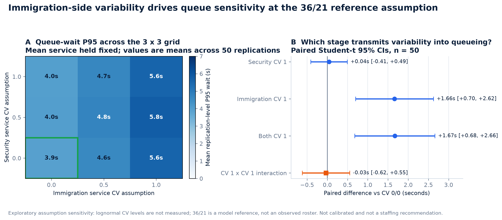
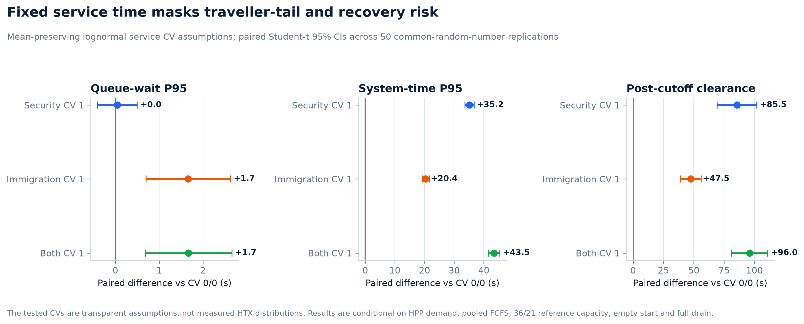

# Task 3 replicated operational results

**Status:** frozen confirmatory capacity study executed — 600/600 AnyLogic
runs, 253,756 entity rows, strict result validation `PASS`, CRN alignment
`PASS`, and primary precision target met. The earlier 150-run pilot remains
valid exploratory and engineering evidence. The separate post-outcome
capacity response surface also completed `2,700/2,700` validated runs; it
remains exploratory and does not alter the confirmatory claim. A further
independent service-variability sensitivity completed `9 x 50 = 450/450`
validated runs with CRN alignment and cross-batch reproducibility `PASS`.
That study is an exploratory assumption sensitivity, not an enlargement of
the confirmatory capacity claim.

**Claim boundary:** a non-calibrated pooled-FCFS assumption sandbox. The
confirmatory capacity study and capacity response surface retain fixed service
times. The separate service-variability study replaces those fixed demands
only with unmeasured, mean-preserving lognormal CV assumptions. All results are
comparative Monte Carlo evidence conditional on their registered inputs; they
are not measured HTX performance, a calibrated baseline, a site forecast, a
staffing answer, an observed roster, or an economic recommendation.

## Executive finding

The decision is **conditional but explicit**:

> Advance joint `Security +4 / Immigration +3` to field calibration at a
> candidate site **only if** measured time-of-day demand,
> corridor-to-processing-unit allocation, stage-service distributions, and
> open-resource schedules reproduce material peak queues. Do not issue a
> staffing or rollout recommendation from this sandbox.

The evidence is rate-dependent: the reference-minus-joint improvement is
`2.678732 s` at the base rate and `33.158314 s` at the high endpoint, while
the `0.066904 s` low-rate improvement is operationally negligible. The joint
case also prevents the bottleneck migration seen when only one serial stage is
expanded. The trigger is therefore an observed stressed operating regime—not
the mere existence of a statistically resolved difference.

This is exactly why the pipeline retains stage timestamps, cutoff state, full
drain, replication-level KPIs, configuration lineage, and confidence
intervals. Animation alone would not show bottleneck migration or hidden
clearance risk.

## Confirmatory evidence health

| Gate | Recorded outcome |
|---|---:|
| Registered grid | 4 capacity alternatives × 3 arrival rates = 12 cells |
| Replications per cell | 50 |
| Exact run coverage | 600 / 600 |
| Entity rows | 253,756 |
| Strict result validator | `PASS`, 0 errors |
| CRN alignment | `PASS` |
| Within-rate CRN groups | 150 |
| Compared branch-invariant draws | 1,141,902 |
| Primary contrast method | paired Student-t |
| Primary paired sample | 50 replication pairs |
| Precision target | half-width `0.382159515 s <= 1.0 s` |

The statistical sample for the primary result is 50 paired replication-level
KPI differences, not the entity rows.

## Confirmatory primary result

The pre-specified primary direction was joint capacity minus reference at the
base arrival rate:

```text
-2.678732146 s, 95% CI [-3.060891661, -2.296572631]
paired n = 50; half-width = 0.382159515 s
```

The interval excludes zero and meets the registered `1.0 s` half-width
target. That target is a Monte Carlo numerical-precision target for the
pre-specified base contrast, not a minimum operationally worthwhile effect.
The interval confirms a reduction in the modelled metric under the frozen
assumptions; it does not establish a staffing or economic recommendation.

For interpretability, the supporting reference-minus-joint improvements are:

| Registered arrival rate | Improvement (s) | Paired 95% CI (s) |
|---|---:|---:|
| Exact 95% low | `0.066904` | `[0.006751, 0.127058]` |
| Point estimate / base | `2.678732` | `[2.296573, 3.060892]` |
| Exact 95% high | `33.158314` | `[31.410389, 34.906238]` |

## Operating-regime and bottleneck evidence

The capacity grid was designed before outcome inspection and already crosses
the nonlinear region. Reference capacity is `36 / 21`, derived as
`ceil(lambda × mean_service / 0.85)` at the base rate; it has not been changed
after seeing results.

| Frozen arrival level | Reference nominal max offered load | Reference total-wait P95 | Joint +4/+3 total-wait P95 | Decision interpretation |
|---|---:|---:|---:|---|
| Low `0.944757/s` | `0.585` | `0.067 s` | `0.000 s` | no capacity action |
| Base `1.364213/s` | `0.845` | `3.929 s` | `1.250 s` | small modelled gain; calibrate before acting |
| High `1.906351/s` | `1.180` | `51.671 s` | `18.513 s` | material stressed-regime signal |

Nominal offered load, 300-second arrival-window utilization, and full-drain
utilization are different denominators. At the high endpoint, reference
arrival-window utilization is `0.964 / 0.902` for Security / Immigration;
joint +4/+3 is `0.948 / 0.881`. The lower full-drain values must not be read as
evidence that the reference is uncongested.

High-rate stage P95s expose bottleneck migration:

| Capacity scenario | Security P95 | Immigration P95 | Total P95 |
|---|---:|---:|---:|
| Reference | `44.107 s` | `8.948 s` | `51.671 s` |
| Security +4 | `17.616 s` | `35.902 s` | `51.305 s` |
| Immigration +3 | `44.107 s` | `1.957 s` | `44.321 s` |
| Joint +4/+3 | `17.616 s` | `2.645 s` | `18.513 s` |

Security-only expansion moves the constraint downstream; Immigration-only
leaves the Security bottleneck. This serial interaction is the substantive
reason to carry the joint mechanism forward.

The immutable entity ledger also supports post-hoc model-scale diagnostics:

| High-rate total queue wait | Reference | Joint +4/+3 | Paired reference-minus-joint difference |
|---|---:|---:|---:|
| `>15 s` | `68.720%` | `20.235%` | `48.485 pp` `[42.780, 54.191]` |
| `>30 s` | `40.997%` | `1.365%` | `39.632 pp` `[35.032, 44.232]` |
| `>60 s` | `4.459%` | `0.000%` | `4.459 pp` `[2.309, 6.609]` |

These 15/30/60-second thresholds were added after the frozen confirmatory
analysis to make the operating regime legible. They are supporting
descriptives—not ICA service standards, SLA thresholds, or new confirmatory
endpoints—and required no AnyLogic rerun. The source entity-log hash and
derived artifact hashes are recorded in the compact audit package.

For total queue-wait P95, joint was lowest at the base and high rates and
tied with Immigration +3 at `0.000 s` at the low endpoint. Some other
pairwise intervals remain unresolved, and strict point-order stability across
rates is therefore false. The study does not show general option dominance.

Tracked evidence:

- [compact analysis package](../results/analysis/confirmatory_capacity/README.md)
- [strict validation report](../results/analysis/confirmatory_capacity/validation.json)
- [CRN alignment report](../results/analysis/confirmatory_capacity/crn_alignment.json)
- [primary result](../results/analysis/confirmatory_capacity/primary_result.json)
- [rate rankings](../results/analysis/confirmatory_capacity/rate_rankings.csv)
- [pairwise contrasts](../results/analysis/confirmatory_capacity/within_rate_pairwise_contrasts.csv)
- [ranking stability](../results/analysis/confirmatory_capacity/ranking_stability.json)
- [post-hoc load-regime manifest](../results/analysis/confirmatory_capacity/regime_diagnostics_manifest.json)
- [post-hoc regime estimates](../results/analysis/confirmatory_capacity/regime_estimates.csv)
- [post-hoc reference-versus-joint contrasts](../results/analysis/confirmatory_capacity/regime_reference_joint_contrasts.csv)

## Exploratory capacity response surface

After the Part 2 outcome was known, a separate exploratory experiment mapped
every integer capacity combination from Security `36` to `28` and Immigration
`21` to `16` at the fixed Base demand input. The design is deliberately
labelled post-outcome and does not enlarge the confirmatory claim above.

| Evidence gate | Recorded outcome |
|---|---:|
| Full factorial grid | `9 × 6 = 54` cells |
| Replications | `50` per cell |
| New self-contained AnyLogic runs | `2,700 / 2,700` |
| Traveller rows | `1,113,588` |
| Frozen hash, lineage, coverage, seed, conservation and full drain | `PASS` |
| Traveller-level CRN alignment | `PASS` |
| Prior/new reproducibility check | `250 / 250`, maximum difference `0.0` |

### Load-exposure and absolute-scale boundary

All 54 cells represent a 300-second terminating arrival cohort from an empty
and idle start, followed by full drain. They use fixed service requirements,
homogeneous continuously available resources, and the accepted directional
corridor rate as the arrival stream to one pooled two-stage abstraction. The
corridor-to-processing-unit allocation is unobserved.

Across the 54 cell estimates, the mean across replications of
within-replication total queue-wait P95 ranges from `3.929` to `35.920 s`; the
mean simultaneous peak total waiting queue ranges from `9.34` to `48.42`
travellers. The `35.920 s` endpoint is a cell-level mean of replication P95s,
not a maximum traveller wait. The tracked threshold diagnostic confirms that
the registered illustrative `600 / 900 / 1200 s` traveller-level exceedance
rates are zero throughout this experiment. Those thresholds are not ICA
service-level agreements, and their zero rates do not establish operational
acceptability.

Nominal offered-load ratios span `0.827–1.063` for Security and
`0.845–1.108` for Immigration. A finite 300-second cohort can drain even when
nominal `rho > 1`; the same cell would not be stable under sustained stationary
demand. The magnitudes below therefore describe this short terminating
experiment, not long-run capacity comfort.

The primary single-stage slices show accelerating delay:

| Capacity change | Mean total queue-wait P95 | Penalty for the next closed position |
|---|---:|---:|
| Security `36 → 35`, Immigration `21` | `3.929 → 4.220 s` | `+0.291 s` |
| Security `29 → 28`, Immigration `21` | `17.459 → 24.434 s` | `+6.975 s` |
| Immigration `21 → 20`, Security `36` | `3.929 → 5.241 s` | `+1.313 s` |
| Immigration `17 → 16`, Security `36` | `20.927 → 35.609 s` | `+14.682 s` |

All adjacent second differences for the primary P95 on these two slices are
positive with paired 95% intervals above zero. The practical insight is not
that one closed position has a fixed cost. Marginal delay accelerates as
capacity approaches and crosses the offered-workload boundaries near
Security `29.765` and Immigration `17.735`.

The full surface shows why the two stage effects must not be added. When
Immigration is fixed at `16`, Security `36` through `31` all produce about
`35.61 s` P95 because Immigration dominates. When Security is fixed at `28`,
Immigration `21` through `17` produce only `24.43` to `25.38 s` because
Security dominates. The active bottleneck migrates across the grid, while
upstream Security capacity meters demand into Immigration. Consistent with
that mechanism, the local paired interaction for `30/18 → 29/17` is
`-4.021 s` (95% CI `[-4.721, -3.320]`). This negative difference-in-
differences means sub-additivity under serial flow; it is not evidence that
joint capacity loss is beneficial.

A deterministic ideal control uses perfectly regular arrivals, the same
fixed service times, pooled FCFS, and the same integer capacities. Its stage
throughput is the straight-line benchmark, but its queue delay is calculated,
not forced to be linear. Ideal total-wait mean and P95 are both zero in
`28 / 54` cells: the rectangle with Security `30–36` and Immigration
`18–21`. They are non-zero in the other `26 / 54` cells—exactly those where
at least one nominal offered-load ratio exceeds one, with Security `≤29` or
Immigration `≤17`. Ideal total-wait P95 spans `7.287–30.519 s` in that
non-zero region.

The stochastic AnyLogic surface has positive waiting before deterministic
saturation because bursty HPP arrival timing and count create transient
queues. AnyLogic-minus-ideal P95 remains positive across all 54 cells
(`3.929–13.556 s`), but this is a model-conditional stochastic-arrival /
congestion contrast with fixed service. It is not a paired causal
decomposition and does not measure service-time variability.

Permitted conclusion:

> Within this fixed Base-demand, non-calibrated sandbox, capacity loss has an
> accelerating rather than constant delay penalty, and the dominant
> constraint migrates between the two serial stages. Arrival variability
> consumes safety margin before nominal saturation; after `rho` crosses one,
> deterministic capacity shortage and stochastic variability jointly
> contribute to delay. Use the surface to identify field-calibration regions
> and candidate stress tests, not to infer roster numbers, recommend staffing,
> or claim long-run stability.

Tracked response-surface evidence:

- [design and execution record](task3_capacity_response_surface_design.md)
- [compact analysis package](../results/analysis/capacity_response_surface/README.md)
- [strict validation](../results/analysis/capacity_response_surface/validation.json)
- [CRN alignment](../results/analysis/capacity_response_surface/crn_alignment.json)
- [registered-threshold diagnostic](../results/analysis/capacity_response_surface/threshold_exceedance_diagnostics.json)
- [single-stage slices](../results/analysis/capacity_response_surface/security_only_slice.csv)
  and
  [Immigration slice](../results/analysis/capacity_response_surface/immigration_only_slice.csv)
- [full heatmap data](../results/analysis/capacity_response_surface/heatmap.csv)
- [bottleneck map](../results/analysis/capacity_response_surface/stage_bottleneck_map.csv)
- [deterministic ideal comparator](../results/analysis/capacity_response_surface/ideal_case_comparator.csv)

## Exploratory service-variability sensitivity

A separate pre-frozen sensitivity asks whether the fixed-service assumption
materially masks queue, traveller-tail, or post-cutoff recovery risk. It holds
the HPP arrival input, mean service demands, pooled-FCFS mechanism, empty
start, full drain, and model reference capacities constant while crossing:

```text
Security service CV    = {0, 0.5, 1.0}
Immigration service CV = {0, 0.5, 1.0}
```

This is a `3 x 3` grid with 50 replications per cell, or `450/450` accepted
AnyLogic runs. Strict validation, registered coverage, lineage, conservation,
full drain, service-demand guards, and CRN alignment all returned `PASS`.
The CV-zero cell also reproduced the prior response-surface `36/21` reference
batch exactly: 50 runs, 20,622 traveller rows and 750 metric values matched,
with maximum absolute metric difference `0.0`.

The `36 Security / 21 Immigration` capacities remain the
target-utilisation-derived **model reference**. They are not an observed
resource schedule, current roster, or staffing recommendation. For CV above
zero, service time is sampled from a strictly positive, mean-preserving
lognormal family. CV `0.5` and `1.0` are transparent assumptions that were not
measured in the supplied video or at an HTX checkpoint. In particular, CV
`1.0` is not an exponential-service or M/M/c claim.

The primary descriptive estimand is the mean across 50 replication-level P95
total queue waits. Paired Student-t intervals are permitted because the
registered arrival, routing and tie streams align exactly across cells, while
stage-local latent service draws align across the applicable positive-CV
comparisons.

| Mean-preserving CV contrast versus `0/0` | Paired P95 queue-wait difference | Paired 95% CI |
|---|---:|---:|
| Security CV `1`, Immigration CV `0` | `+0.042 s` | `[-0.410, 0.494]` |
| Security CV `0`, Immigration CV `1` | `+1.660 s` | `[0.698, 2.623]` |
| Security CV `1`, Immigration CV `1` | `+1.668 s` | `[0.677, 2.660]` |

Within this tested reference cell, the P95 queue-wait response is therefore
more sensitive to Immigration-side service variability than to
Security-side variability. The Security-only estimate is close to zero and
its interval spans zero; that does not prove that real Security service
variability has no effect. The CV `1 x 1` factorial interaction is
`-0.033 s` with 95% CI `[-0.618, 0.551]`. It remains unresolved, so the study
does not support a synergistic or antagonistic interaction claim for this
metric.

Queue wait alone understates the consequences of variable service duration.
At joint CV `1/1` versus fixed service, modelled system-time P95 increases by
`43.471 s` (95% CI `[41.565, 45.376]`) and post-cutoff cohort-clear time by
`95.993 s` (`[81.162, 110.823]`). These are paired Monte Carlo differences
inside the registered lognormal sandbox, not forecasts of traveller
experience or operational recovery time.





Permitted conclusion:

> Fixed service time is decision-relevant: under mean-preserving positive
> lognormal CV assumptions, tail and recovery metrics increase even when mean
> demand and capacity do not change. At the `36/21` model reference, the
> queue-wait signal is concentrated on the Immigration side, while the
> Security-only queue contrast and joint factorial interaction remain
> unresolved. Measure stage-specific service distributions before using the
> model for site calibration; do not infer roster requirements from this
> sensitivity.

Tracked service-variability evidence:

- [frozen design and claim boundary](task3_service_variability_design.md)
- [strict validation](../results/analysis/service_variability/validation.json)
- [CRN alignment](../results/analysis/service_variability/crn_alignment.json)
- [cross-batch reproducibility](../results/analysis/service_variability/cross_batch_reproducibility.json)
- [cell estimates](../results/analysis/service_variability/cell_estimates.csv)
- [paired contrasts](../results/analysis/service_variability/paired_contrasts_vs_reference.csv)
- [factorial interactions](../results/analysis/service_variability/factorial_interactions.csv)
- [analysis manifest](../results/analysis/service_variability/analysis_manifest.json)

## Conditional pooled-versus-separate queue replay

A separate fail-closed counterfactual replays the immutable confirmatory
reference ledger under two genuine mechanisms: pooled FCFS and one
shortest-number-in-lane queue per counter with deterministic logged ties and
no jockeying. Replayed Security completions feed Immigration, and both layouts
retain each traveller's arrival, service demands, additional-check flag and
tie draw.

The reference pooled replay passed 164,976 timestamp/wait comparisons and 50
registered within-replication P95 comparisons with zero mismatches (maximum
absolute error about `1.01e-9 s`). Both within-cell traveller-input/CRN gates
passed.

| Frozen cell | Pooled mean P95 | Separate mean P95 | Separate minus pooled, paired 95% CI | Peak-total queue contrast |
|---|---:|---:|---:|---:|
| Reference `36/21`, 300 s | `3.929 s` | `11.509 s` | `+7.580 s` `[6.969, 8.192]` | `+1.78` `[1.35, 2.21]` |
| Illustrative normalized `6/4`, arrivals ×5, 1,500 s | `69.396 s` | `76.436 s` | `+7.040 s` `[6.238, 7.843]` | `+1.62` `[1.38, 1.86]` |

Separate-lane fragmentation occupied an additional `0.289` of the summed
stage observation spans at reference scale (95% CI `[0.264, 0.314]`) and
`0.143` at the illustrative normalized scale (95% CI `[0.136, 0.149]`).
Raw fragmentation seconds are retained within each cell but deliberately
excluded from the cross-scale summary because the horizons differ. The
dimensionless fraction uses each stage's first-arrival-to-final-completion
span, with the total denominator equal to the sum of the two stage spans.

The `6/4` cell is a transparent mechanism-only normalization: source arrival
times are multiplied by five while service requirements, flags and tie draws
remain fixed. It runs only after the exact reference replay gate passes and is
not claimed as a separate AnyLogic run, current HTX/ICA queue policy, site
validation, or staffing recommendation. The AnyLogic operational UI remains
pooled FCFS.

Tracked queue-layout evidence:

- [public synthetic replay source and privacy/hash manifest](../data/derived/queue_layout_replay_source/)
- [frozen design and claim boundary](task3_queue_layout_replay_design.md)
- [analysis manifest](../results/analysis/queue_layout_replay/analysis_manifest.json)
- [exact pooled replay gate](../results/analysis/queue_layout_replay/pooled_replay_validation.json)
- [within-cell CRN gates](../results/analysis/queue_layout_replay/crn_validation.json)
- [paired contrasts](../results/analysis/queue_layout_replay/paired_contrasts.csv)
- [dimensionless cross-scale summary](../results/analysis/queue_layout_replay/cross_scale_mechanism_summary.csv)
- [compact local-event audit digest](../results/analysis/queue_layout_replay/counter_event_audit_digest.json)

## Pilot evidence retained

The earlier `15 × 10 = 150` run pilot remains useful for pipeline verification,
variance estimation, broad sensitivity screening, and engineering diagnosis.
Its contrasts remain exploratory independent-Welch results because pilot CRN
alignment was `NOT_TESTED`; the confirmatory `PASS` does not apply
retroactively.

## Pilot reference assumption sandbox

`REFERENCE_ASSUMPTION_SANDBOX_V1` uses the accepted Task 1 rate
`1.364213/s`, HPP arrivals for 300 seconds, 36 Security resources at fixed
21.818181818-second demand, 21 Immigration resources at fixed 13-second
demand, pooled FCFS, empty/idle start, and full drain.

| Metric | Mean | 95% CI |
|---|---:|---:|
| Replication-level total queue-wait P95 | 3.52 s | 2.92–4.12 s |
| Total queue wait mean | 0.67 s | 0.48–0.87 s |
| Security wait P95 | 2.07 s | 1.44–2.71 s |
| Immigration wait P95 | 2.32 s | 1.99–2.65 s |
| Security utilization | 74.0% | 71.3%–76.7% |
| Immigration utilization | 75.6% | 72.9%–78.3% |
| Not exited at the 300 s cutoff | 11.94% | 10.56%–13.32% |
| Cohort clear after cutoff | 35.31 s | 34.11–36.50 s |

The reference averages 409.4 arrivals and 360.5 exits by the cutoff. Its low
wait is unsurprising: the reference was deliberately capacity-derived with
headroom, uses fixed service times, and starts empty and idle. It must not be
described as observed baseline performance.

## Pilot capacity and bottleneck migration

| Scenario | Security P95 | Immigration P95 | Utilization S / I | Total P95 |
|---|---:|---:|---:|---:|
| Reference | 2.07 s | 2.32 s | 74.0% / 75.6% | 3.52 s |
| Security +4 | 0.02 s | 2.52 s | 65.1% / 73.8% | 2.68 s |
| Immigration +3 | 2.12 s | 0.17 s | 74.6% / 66.7% | 2.31 s |
| Both +4/+3 | 0.75 s | 0.75 s | 67.8% / 67.3% | 1.62 s |

Scenario-minus-reference total-P95 contrasts:

- Security +4: **−0.84 s** (95% CI −1.81 to +0.13), unresolved at `n=10`.
- Immigration +3: **−1.21 s** (−3.01 to +0.59), unresolved at `n=10`.
- Both: **−1.91 s** (−3.37 to −0.44), a clear but operationally small
  reduction under this sandbox.

Single-stage capacity largely removes its own stage wait while leaving the
other stage active. The joint case best expresses the balanced serial-system
mechanism; it is not an economic optimum because costs and roster constraints
are absent.

## Pilot dominant sensitivities

| Scenario | Total queue-wait P95 | Not exited at cutoff | Clear after cutoff |
|---|---:|---:|---:|
| Reference | 3.52 s | 11.9% | 35.3 s |
| Demand +20% | 17.06 s | 15.6% | 48.3 s |
| Immigration context 24 s | 164.87 s | 45.2% | 218.8 s |
| Immigration context 45 s | 513.87 s | 71.0% | 604.6 s |
| Counter-held proxy: 2% × 900 s | 47.29 s | 22.1% | 953.8 s |
| Counter-held proxy: 2% × 7,200 s | 30.36 s | 18.6% | 7,214.2 s |

- Demand `+20%` raises the primary P95 by **13.54 s** (95% CI
  +7.21 to +19.86), illustrating nonlinear queue growth as both stages
  approach capacity.
- The 24-second and 45-second Immigration contexts increase the primary P95
  by **161.35 s** and **510.35 s**, respectively. Immigration becomes the
  unambiguous downstream constraint.
- The risk rows are deliberately pessimistic foreign-boundary proxies. Their
  long clear times show why a queue-wait P95 alone is insufficient.

The 7,200-second risk row having a lower queue-wait P95 than the 900-second
row is **not** an improvement: the rare 2% branch can be missed by a P95,
queue wait excludes the additional service duration, different random
samples are used, and there are only 10 pilot replications. Full-drain clear
time correctly exposes the extreme operational consequence.

## Pilot automation scenarios

All automation variants reduce Immigration utilization and make Security the
residual tail. Primary-P95 contrasts are:

- HTX context, 50% uptake at `0.6×`: **−1.41 s**
  (95% CI −2.77 to −0.04);
- HTX context, 100% uptake at `0.6×`: **−0.67 s**
  (−2.32 to +0.99);
- ICA context, 50% uptake at `0.4×`: **−1.47 s**
  (−2.67 to −0.26); and
- ICA context, 100% uptake at `0.4×`: **−1.58 s**
  (−3.05 to −0.11).

The apparent non-monotonic HTX 50%/100% point estimates are sampling noise,
not evidence that more uptake is worse. Fine rankings are provisional because
CRN alignment is not verified and `n=10`.

## Why the pilot guardrails cannot be used as a traffic light

Every scenario is below the illustrative 900-second upper-CI rule for the
primary queue-wait P95, so that rule does not discriminate this pilot.
Conversely, every scenario exceeds the draft `≤5%` cutoff-backlog rule.

The backlog rule is structurally misaligned with a 300-second, empty-start
arrival window: in the reference, the mean 48.9 travellers not yet exited at
the cutoff comprise only 1.8 queued and 47.1 normally in service. “Not exited
at cutoff” is therefore mostly expected process WIP, not abandonment or
congestion. It should be reported descriptively until a calibrated horizon
and service-level definition exist.

The two risk-bound rows also exceed the 900-second cohort-clear guardrail.
Those are boundary failures under the counter-held proxy, not forecasts of
ICA operations.

## Interpretation limits

- The confirmatory claim is limited to the pre-specified base-rate
  joint-minus-reference contrast; the low/high contrasts and rankings are
  supporting.
- The 54-cell response surface was designed after viewing Part 2 outcomes,
  holds demand at the Base input, and is exploratory. Its paired intervals
  describe Monte Carlo uncertainty under the tested grid; they are not
  multiplicity-adjusted confirmatory tests.
- The deterministic ideal comparator removes arrival variability by design.
  It is an interpretive lower-variability control, not a site baseline or a
  causal counterfactual.
- Joint is lowest at base/high and tied-lowest with Immigration +3 at the low
  endpoint; unresolved pairwise intervals preclude a general dominance claim.
- Ten replications are a pilot count; pilot contrasts remain exploratory and
  must not inherit the confirmatory study's paired status.
- Confidence intervals quantify Monte Carlo error conditional on fixed
  assumptions; they omit input uncertainty and model-form error.
- The 154 contrasts are exploratory and have no multiplicity adjustment.
- The executable AnyLogic model and interactive UI remain pooled FCFS.
  A separate layout exists only as the exact-gated offline entity-ledger
  counterfactual above; it does not identify the current site queue policy.
- The confirmatory study and capacity response surface use fixed service
  times. The independent service-variability sensitivity relaxes only that
  assumption at unmeasured CV `0.5/1.0`; homogeneous resources, HPP arrivals,
  and empty/idle starts still suppress important real-world variability.
- The directional corridor rate is conditionally routed into one pooled model;
  processing-unit allocation, within-site routing, and sharing/overflow are
  unobserved.
- Utilization is normalized over each scenario's full-drain horizon; very
  long risk drains lower the utilization denominator and must not be read as
  within-window spare capacity.
- Negative Student-t bounds for non-negative KPIs are mathematical interval
  artifacts, not physically negative waiting.
- Automation multipliers, service contexts, and referral rows are registered
  scenario anchors/proxies, not adoption forecasts or local measurements.
- Costs, implementation risk, and roster constraints are absent; no economic
  optimum can be selected.

## Reproduce

The frozen confirmatory replay procedure is recorded in the
[confirmatory design and execution record](task3_confirmatory_design.md).
Its checked-in outputs are documented in the
[tracked compact analysis package](../results/analysis/confirmatory_capacity/README.md).

To reproduce the retained pilot, run
`OperationalPilot: OperationalCheckpointModel` in AnyLogic PLE and wait for
`Finished`, then:

```powershell
.\.venv\Scripts\python.exe -m src.analysis.validate_operational_contract
.\.venv\Scripts\python.exe -m src.analysis.consolidate_operational_results
.\.venv\Scripts\python.exe -m src.analysis.validate_operational_results `
  --require-pilot-coverage
.\.venv\Scripts\python.exe -m src.analysis.analyse_operational_replications
.\.venv\Scripts\python.exe -m src.analysis.build_operational_dashboard
```

Tracked pilot evidence:

- [strict validation report](../results/analysis/operational/validation.json)
- [analysis manifest](../results/analysis/operational/analysis_manifest.json)
- [scenario estimates](../results/analysis/operational/scenario_estimates.csv)
- [scenario contrasts](../results/analysis/operational/scenario_contrasts.csv)
- [dashboard PNG](../results/analysis/operational/operational_dashboard.png)
- [concise generated summary](../results/analysis/operational/README.md)
