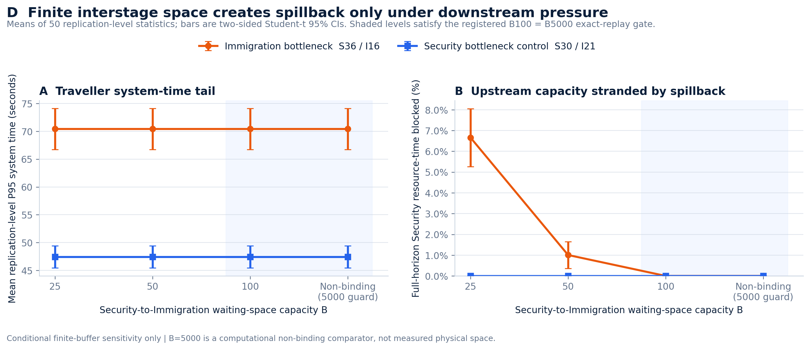

# Finite interstage-buffer spillback evidence package

## Evidence status

`TASK3_INTERSTAGE_BUFFER_SPILLBACK_SENSITIVITY_V1` was executed and
validated on 2026-07-30.

| Gate | Outcome |
|---|---:|
| Factorial | 2 capacity regimes x 4 buffer levels |
| Buffer levels | `25 / 50 / 100 / 5000` travellers |
| Replications | `50` per cell |
| AnyLogic runs | `400 / 400` |
| Registered contract | `PASS` |
| Import validation | `PASS` |
| Traveller-level CRN alignment | `PASS` |
| Exact non-binding replay | `PASS` |
| Negative-control invariance | `PASS` |
| Conservation, zero loss, and full drain | `PASS` |

This is a conditional finite-space sensitivity, not a measured corridor
capacity, site forecast, roster recommendation, or production SOP.

## Frozen question and mechanism

The study asks:

> When the downstream stage is constraining, does finite waiting space between
> Security and Immigration increase traveller delay, or relocate congestion
> upstream by retaining Security resources?

The AnyLogic mechanism uses blocking-after-service:

- a traveller who finishes Security must reserve an interstage-buffer slot;
- if the buffer is full, the traveller remains attached to the Security
  resource until a slot is available;
- the traveller releases the buffer slot when Immigration service starts;
- no traveller is dropped, rejected, preempted, or silently discarded;
- arrivals close at the registered cutoff and every admitted traveller drains.

The registered regimes are:

| Regime | Security / Immigration | Purpose |
|---|---:|---|
| Immigration bottleneck | `36 / 16` | Positive spillback case |
| Security bottleneck | `30 / 21` | Negative control |

Capacity means concurrent model service positions. Buffer capacity is a
scenario assumption and has not been measured at the assessment site.

## Main descriptive result

Under the Immigration-bottleneck case `36 / 16`, mean Security resource-time
blocked after service completion is:

| Buffer capacity B | Mean blocked resource-time |
|---:|---:|
| `25` | `6.6576%` |
| `50` | `1.0069%` |
| `100` | `0%` |
| `5000` | `0%` |

The mean of replication-level system-time P95s is `70.4274 s` at every tested
buffer level. Thus, under the current no-loss, single-path, work-conserving,
full-drain tandem assumptions, finite space changes where waiting occurs and
how long upstream resources remain locked; it does not change the downstream
service order or the reported system-time P95.

The Security-bottleneck negative control `30 / 21` records `0%` blocked
resource-time at every buffer level. `B=100` exactly reproduces the
non-binding `B=5000` comparator in all 50 paired replications in both regimes.



Connected points are scenario comparisons only. Evidence exists at
`B={25,50,100,5000}`; `B=5000` is a computationally non-binding comparator,
not a physical design recommendation.

## Package contents

- [`validation.json`](validation.json): registered coverage, conservation,
  zero-loss, full-drain, schema, and domain checks.
- [`registered_contract.json`](registered_contract.json): frozen design and
  seed coverage.
- [`crn_alignment.json`](crn_alignment.json): traveller-level
  common-random-number alignment.
- [`exact_replay_validation.json`](exact_replay_validation.json):
  non-binding replay gate.
- [`negative_control_invariance.json`](negative_control_invariance.json):
  Security-bottleneck invariance gate.
- [`replication_kpis.csv`](replication_kpis.csv): one validated KPI row per
  run.
- [`cell_estimates.csv`](cell_estimates.csv): cell means and
  across-replication intervals.
- [`chart_d_payload.json`](chart_d_payload.json): claim-bounded plotting
  payload.
- [`analysis_manifest.json`](analysis_manifest.json): hashes, lineage, gates,
  and output inventory.

Raw run files remain under `results/raw/interstage_buffer_sensitivity/`; they
are validated and hash-bound but are not duplicated in this compact package.

## Reproduce

Open the single-file AnyLogic model and run
`InterstageBufferSpillbackSensitivity: SpillbackCheckpointModel` until the
experiment reports `Finished`:

```text
simulation/anylogic/HTXCheckpointSimulationCLI/HTXCheckpointSimulationCLI.alp
```

Then rebuild the compact analysis package from the repository root:

```powershell
.\.venv\Scripts\python.exe -m src.analysis.consolidate_interstage_buffer_results
.\.venv\Scripts\python.exe -m src.analysis.analyse_interstage_buffer
.\.venv\Scripts\python.exe -m src.analysis.plot_interstage_buffer
```

The analyser fails closed unless all 400 registered runs, input hashes,
traveller-level CRN alignment, exact replay, negative-control invariance,
conservation, zero loss, and full drain pass.

## Interpretation limits

- The supplied video does not measure interstage waiting-space capacity.
- The two capacity regimes are selected model cases, not observed staffing.
- Service demands, stationary HPP arrivals, pooled FCFS, and the 300-second
  arrival window remain explicit assumptions.
- Confidence intervals quantify Monte Carlo error conditional on fixed model
  inputs; they exclude input uncertainty and model-form error.
- No site forecast, physical layout prescription, staffing recommendation,
  cost optimum, SLA, or production SOP is supported.
