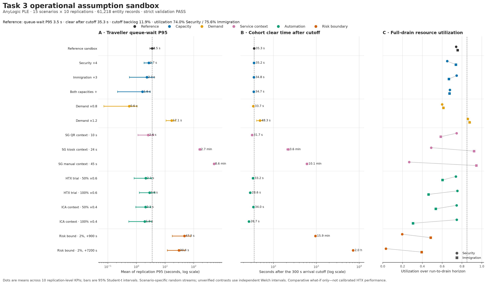

# Task 3 operational results

**Status:** 150/150 AnyLogic runs and 61,218 entity records passed strict schema, lineage, seed, conservation, and full-drain validation.

**Claim boundary:** Monte Carlo uncertainty conditional on the registered assumption scenarios. These results are not calibrated HTX performance, a site forecast, or a staffing recommendation.



## Reference sandbox

| Metric | Mean across replications | 95% CI |
|---|---:|---:|
| Traveller queue-wait P95 | 3.52 s | 2.92–4.12 s |
| Clear time after 300 s cutoff | 35.31 s | 34.11–36.50 s |
| Cutoff backlog fraction | 11.94% | 10.56–13.32% |
| Security utilization | 74.00% | 71.33–76.67% |
| Immigration utilization | 75.58% | 72.86–78.31% |

## Primary scenario contrast

The primary estimand is the mean of the 10 replication-level traveller queue-wait P95 values. Differences below are scenario minus reference.

| Scenario | Difference | 95% CI | Interpretation |
|---|---:|---:|---|
| Security +4 | -0.84 s | -1.81 to +0.13 s | Direction not resolved at n=10 |
| Immigration +3 | -1.21 s | -3.01 to +0.59 s | Direction not resolved at n=10 |
| Both capacities + | -1.91 s | -3.37 to -0.44 s | Lower under this scenario |
| Demand ×0.8 | -2.96 s | -3.68 to -2.25 s | Lower under this scenario |
| Demand ×1.2 | +13.54 s | +7.21 to +19.86 s | Higher under this scenario |
| SG QR context · 10 s | -0.96 s | -2.46 to +0.54 s | Direction not resolved at n=10 |
| SG kiosk context · 24 s | +161.35 s | +146.19 to +176.50 s | Higher under this scenario |
| SG manual context · 45 s | +510.35 s | +480.55 to +540.14 s | Higher under this scenario |
| HTX trial · 50% ×0.6 | -1.41 s | -2.77 to -0.04 s | Lower under this scenario |
| HTX trial · 100% ×0.6 | -0.67 s | -2.32 to +0.99 s | Direction not resolved at n=10 |
| ICA context · 50% ×0.4 | -1.47 s | -2.67 to -0.26 s | Lower under this scenario |
| ICA context · 100% ×0.4 | -1.58 s | -3.05 to -0.11 s | Lower under this scenario |
| Risk bound · 2%, +900 s | +43.76 s | +14.24 to +73.29 s | Higher under this scenario |
| Risk bound · 2%, +7200 s | +26.83 s | +8.31 to +45.36 s | Higher under this scenario |

## Reading the result

- The reference has little queueing under its own assumptions; fine-grained capacity or automation rankings are therefore uncertain with only 10 replications.
- The dominant result is sensitivity to Immigration service time and demand. The 24 s and 45 s service contexts produce large queueing and drain-time increases; the 1.2× demand scenario also materially worsens the primary estimand.
- The risk rows are external boundary stresses. Their long clear times reflect the deliberately pessimistic counter-held proxy and must not be presented as ICA practice.
- Separate scenario seeds preserve the independent Welch analysis. `crn_alignment_status` remains `NOT_TESTED`; no paired-CRN precision claim is made.

## Reproduce

```powershell
.\.venv\Scripts\python.exe -m src.analysis.validate_operational_results --require-pilot-coverage
.\.venv\Scripts\python.exe -m src.analysis.consolidate_operational_results
.\.venv\Scripts\python.exe -m src.analysis.analyse_operational_replications
.\.venv\Scripts\python.exe -m src.analysis.build_operational_dashboard
```
