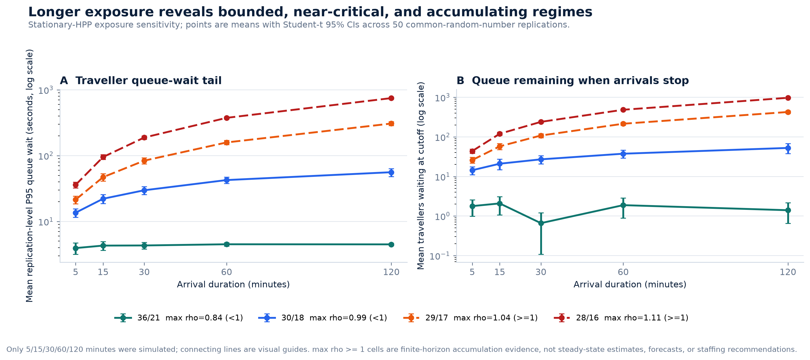
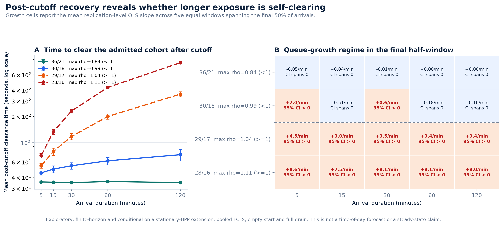

# Peak-duration sensitivity evidence package

## Evidence status

`TASK3_PEAK_DURATION_SENSITIVITY_EXPLORATORY_V1` was executed and validated
on 2026-07-29.

| Gate | Outcome |
|---|---:|
| Factorial | 4 selected capacity cells x 5 arrival-window durations |
| Replications | `50` per cell |
| AnyLogic runs | `1000 / 1000` |
| Traveller entity rows | `3,768,780` |
| Raw result files | `3,000` |
| Strict validation | `PASS` |
| Same-duration and nested-prefix CRN alignment | `PASS` |
| T=300 cross-batch reproducibility | `PASS` (`200` runs; `82,488` rows) |
| Frozen fixed-service demand contract | `PASS` |
| Conservation, zero loss, and full drain | `PASS` |
| Computational guards non-binding | `PASS` |

This is exploratory finite-horizon evidence under a stationary-HPP extension,
not calibration. The immutable pre-run design continues to record
`execution_status=NOT_EXECUTED` and `completed_run_count=0`; those frozen
intent fields are not rewritten after observing results. Accepted execution
is recorded by [`validation.json`](validation.json) and
[`analysis_manifest.json`](analysis_manifest.json).

## Frozen question and mechanism

The study asks:

> If the accepted short-window directional rate is conditionally sustained as
> a stationary HPP, how do queue burden and post-cutoff recovery change with
> exposure duration at four selected capacity regimes?

Every run uses:

- `1.3642132969720073` arrivals/s under the distinct
  `LOCAL_WINDOW_HPP_BASE_STATIONARY_EXTENSION` identity;
- arrival cutoffs `300`, `900`, `1800`, `3600`, and `7200` seconds;
- Security/Immigration capacities `36/21`, `30/18`, `29/17`, and `28/16`;
- fixed mean service assumptions, pooled FCFS, automation disabled, and no
  additional checks;
- an empty and idle start, arrival closure at the registered cutoff, and full
  cohort drain.

Capacity means concurrently open model service positions. It is not an
observed roster, installed estate, or staffing recommendation.

## Main descriptive result

The primary P95 estimand is the mean of 50 replication-level P95 total queue
waits. It is not a P95 pooled across all travellers.

| Capacity S / I | Maximum offered-work `rho` proxy | Mean P95 at 5 min | Mean P95 at 120 min, 95% CI | Mean cutoff waiting queue at 120 min | Mean clear after cutoff at 120 min |
|---:|---:|---:|---:|---:|---:|
| `36 / 21` | `0.845` | `3.929 s` | `4.472 s` `[4.274, 4.670]` | `1.40` | `34.864 s` |
| `30 / 18` | `0.992` | `13.556 s` | `55.910 s` `[48.172, 63.649]` | `52.58` | `72.675 s` |
| `29 / 17` | `1.043` | `21.394 s` | `307.148 s` `[285.578, 328.717]` | `425.92` | `360.480 s` |
| `28 / 16` | `1.108` | `35.920 s` | `748.204 s` `[725.333, 771.074]` | `973.46` | `825.773 s` |

The result separates four finite-horizon regimes:

- `36/21`: low, stable queue burden across the tested horizons;
- `30/18`: a long near-critical stochastic transient even though maximum
  offered-work `rho` remains just below one;
- `29/17`: sustained finite-horizon accumulation;
- `28/16`: stronger sustained finite-horizon accumulation.

At 120 minutes, the replication-level queue-growth slopes for `29/17` and
`28/16` are `0.0566` travellers/s (95% CI `[0.0503, 0.0630]`) and `0.1336`
travellers/s (`[0.1272, 0.1399]`). No steady-state KPI or SLA is estimated for
cells with `rho >= 1`.





Connected lines between the five durations are visual guides. Evidence exists
only at the simulated duration points.

## Validation interpretation

The exact CRN gate compares every branch-invariant exogenous arrival and draw
within the same duration across capacities, and checks that every longer
duration contains the exact shorter-duration arrival prefix. It passed before
paired duration increments were emitted.

The T=300 cross-batch gate compares the newly executed duration-study cells
against the prior response-surface batches. All `200` runs, `82,488`
traveller rows, recorded behavioural event fields, and analysis metrics
matched. Batch lineage, traveller-ID prefixes, and presentation-only resource
IDs are deliberately excluded from behavioural identity. Prior rows validate
reproduction only and do not contribute observations to the duration
estimates.

The dynamic source and queue limits are computational guards, not physical
queue capacities. They remained non-binding in every accepted run.

## Package contents

- [`validation.json`](validation.json): fail-closed coverage, hashes, lineage,
  conservation, zero-loss, full-drain, guard, reconstruction, CRN, and
  cross-batch status.
- [`crn_alignment.json`](crn_alignment.json): exact same-duration
  cross-capacity and nested-duration-prefix alignment.
- [`cross_batch_reproducibility.json`](cross_batch_reproducibility.json):
  T=300 behavioural-ledger and metric reproduction.
- [`analysis_manifest.json`](analysis_manifest.json): hashes, row counts,
  source lineage, and output inventory.
- [`raw_artifact_manifest.csv`](raw_artifact_manifest.csv): digest and
  inventory of the 3,000 raw files without duplicating entity ledgers.
- [`peak_duration_by_replication.csv`](peak_duration_by_replication.csv):
  one validated KPI row per run.
- [`cell_estimates.csv`](cell_estimates.csv): cell-level estimates and
  across-replication Student-t intervals.
- [`duration_increments.csv`](duration_increments.csv): CRN-gated paired
  adjacent-duration differences.
- [`growth_diagnostics.csv`](growth_diagnostics.csv): replication-level
  within-window queue-growth estimates.
- [`curves_payload.json`](curves_payload.json): compact plotting and reporting
  payload.

Raw run files remain under `results/raw/peak_duration_sensitivity/`; they are
validated and hash-bound but are not duplicated in this compact package.

## Reproduce

Open the single-file AnyLogic model and run
`PeakDurationSensitivity: OperationalCheckpointModel` until the experiment
reports `Finished`:

```text
simulation/anylogic/HTXCheckpointSimulationCLI/HTXCheckpointSimulationCLI.alp
```

Then rebuild the fail-closed analysis package from the repository root:

```powershell
.\.venv\Scripts\python.exe -m src.analysis.analyse_peak_duration_sensitivity
.\.venv\Scripts\python.exe -m src.analysis.plot_peak_duration_sensitivity
```

The command refuses to release estimates unless all 1,000 registered runs,
strict runtime validation, entity reconstruction, CRN alignment, and
cross-batch reproducibility pass.

## Interpretation limits

- The supplied 24.9-second video does not establish that the measured rate
  persists for 15, 30, 60, or 120 minutes.
- This is a stationary-HPP exposure sensitivity, not an observed peak,
  time-of-day model, or daily demand profile.
- The study is terminating and fully drained. It does not emit a steady-state
  service-level result, especially where `rho >= 1`.
- The accepted corridor rate is conditionally routed into one pooled
  two-stage abstraction; processing-unit allocation is unobserved.
- Confidence intervals quantify Monte Carlo error conditional on fixed model
  inputs. They exclude input uncertainty and model-form error.
- No calibrated baseline, site forecast, physical queue-size claim, staffing
  recommendation, cost optimum, or operational SLA is supported.
